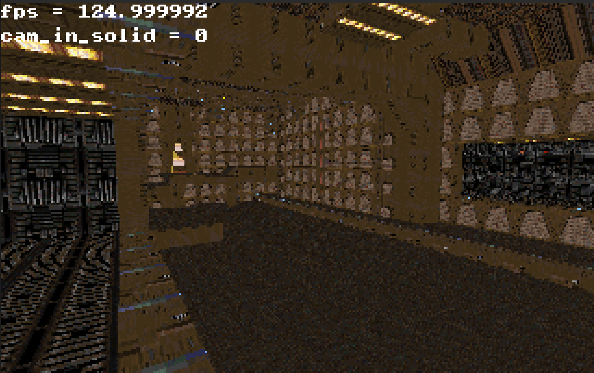

## Tremor

Tremor is a 3D-Engine I've written which uses a custom Quake-Style software
renderer.

<figure>
  
  <figcaption>Demo of Quake E1M1</figcaption>
</figure>

The code is designed to be easy to port to any platform and be pretty much
dependency free.

## Features

Loading in .map and .wad (the wad2 format specifically) files and compiling them
to a BSP tree.

### NOTE
Textures are slightly bugged for .map files, and very bugged for valve220 format
.map files. This will be fixed eventually but currently getting the BSP working
bug-free is my priority.

## Dependencies

Raylib is used as a pass-through to put pixels onto the screen as well as
getting user input, but swapping it out for any other graphics library should be
pretty easy as the dependency on Raylib is kept to a minimum and seperated from
the engine itself. Instructions on how to swap out Raylib for any other library
as a backend are laid out below.

CMake for building the project.

## Using a Custom Rendering and Input Backend

Swapping out Raylib for any other graphics and input library as a backend only
requires two things:
*   An implementation of the Screen class in src/screen/screen.hpp.
*   An implementation of the functions in the Input namespace in
    src/input/input.hpp
You can use the pre-existing Raylib implementation for both as a guide.
